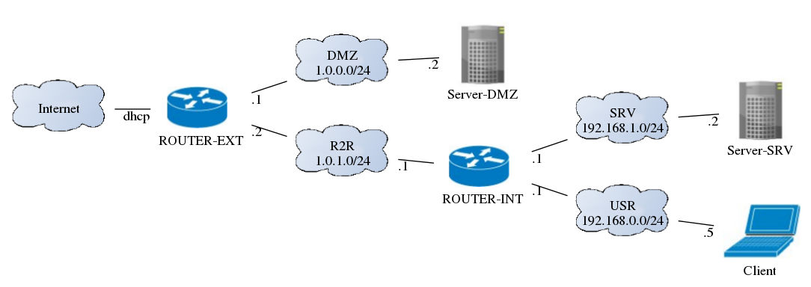

#What is this?#

Example files for the System Design class network documentation generator at EAL.

## Files ##

### Week 45 ##

 * [basic_net.yaml](basic_net.yaml): YAML input example for week 45.
 * [basic_net.dot](basic_net.dot): Dot file for the example for week 45.

### Week 46 ##

 * [w46_first.yaml](w46_first.yaml): YAML input first example for week 46.
 * [w46_first.dot](w46_first.dot): Dot file for the first example for week 46.
 * [w46_first.png](basic_net.dot): Rendered dot output for the first example for week 46.
 * [w46_second.yaml](w46_first.png): YAML input second example for week 46.
 * [w46_second.dot](w46_second.dot): Dot file for the second example for week 46.
 * [w46_second.png](w46_second.png):  Rendered dot output for the second example for week 46.

### Week 47 ##

 * [w46_first.yaml](w46_first.yaml): YAML input first example for week 47.
 * [w46_first.dot](w46_first.dot): Dot file for the first example for week 47.
 * [w47_first_L2.png](w47_first_L2.png): Rendered dot L2 output for the first example for week 47.
 * [w47_first_L3.png](w47_first_L3.png): Rendered dot L3 output for the first example for week 47.
 * [w46_second.yaml](w46_first.png): YAML input second example for week 47.
 * [w46_second.dot](w46_second.dot): Dot file for the second example for week 47.
 * [w47_second_L2.png](w47_second_L2.png): Rendered dot L2 output for the first example for week 47.
 * [w47_second_L3.png](w47_second_L3.png): Rendered dot L3 output for the first example for week 47.
 * [w46_third.yaml](w46_third.yaml): YAML input first example for week 47.
 * [w46_third.dot](w46_third.dot): Dot file for the first example for week 47.
 * [w47_third_L2.png](w47_third_L2.png): Rendered dot L2 output for the first example for week 47.
 * [w47_third_L3.png](w47_third_L3.png): Rendered dot L3 output for the first example for week 47.

### General ###

 * [node_types.yaml](node_types.yaml): YAML file containing default values for all node
									   types.

## Rendered output ##

### Week 45 ###

#### Basic network ####

### Week 46 ###

#### First network ####

#### Second network ####

### Week 47 ###

#### First network ####

#### Second network ####

#### Third network ####

w47_first_L2.dot
-rwxrwxr-x 1 oblivion users  52665 dec  5 22:55 
-rwxrwxr-x 1 oblivion users    590 nov 21 14:23 w47_first_L3.dot
-rwxrwxr-x 1 oblivion users  46194 dec  5 22:55 
-rwxrwxr-x 1 oblivion users    506 nov 21 14:46 w47_second_L2.dot
-rwxrwxr-x 1 oblivion users  41837 nov 21 15:07 
-rwxrwxr-x 1 oblivion users    698 nov 21 14:50 w47_second_L3.dot
-rwxrwxr-x 1 oblivion users  56376 dec  5 22:55 
-rwxrwxr-x 1 oblivion users    878 nov 21 15:15 w47_third_L2.dot
-rwxrwxr-x 1 oblivion users  74776 nov 21 15:16 
-rwxrwxr-x 1 oblivion users   1234 nov 21 15:29 w47_third_L3.dot
-rwxrwxr-x 1 oblivion users  97195 dec  5 22:55 

